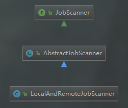
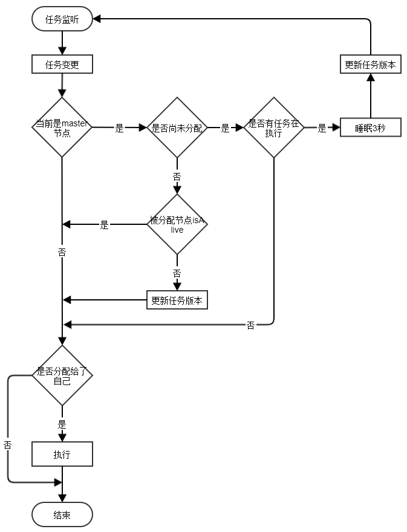
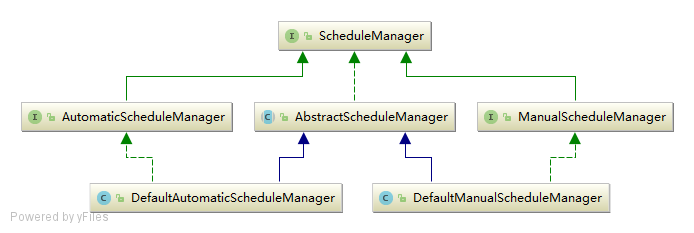
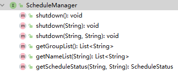
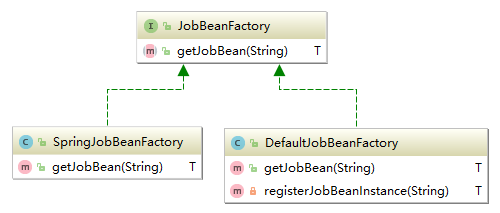
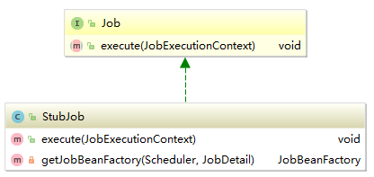

# Web

## 任务上传

这里采用无Spring环境的任务作为示例，代码:

```java
public class Job {
    @Schedule(cron = "0/15 * * * * ?")
    public void doJob() {
        System.out.println("这是测试任务.");
    }
}
```

详细的任务代码编写说明参考原版博客: 

[【niubi-job——一个分布式的任务调度框架】----如何开发一个niubi-job的定时任务](http://www.cnblogs.com/zuoxiaolong/p/niubi-job-2.html)

任务上传由接口`/masterSlaveJobs/upload`完成。

### 重复校验

每上传一个任务都会将任务的概览信息存储的数据库的master_slave_job表，以Master-Slave模式为例，这里进行校验的依据便是文件名。

### 类加载器创建

关键源码:

```java
ApplicationClassLoader classLoader = 
  ApplicationClassLoaderFactory
  .createNormalApplicationClassLoader(applicationContext.getClassLoader(), jarFilePath);
```

applicationContext是Spring便是通过ApplicationContextAware接口注入进来的Spring容器，而AbstractApplicationContext继承自DefaultResourceLoader，ResourceLoader接口中getClassLoader方法源码:

```java
@Override
public ClassLoader getClassLoader() {
    return (this.classLoader != null ? this.classLoader : ClassUtils.getDefaultClassLoader());
}
```

classLoader通过构造器传入，但是Spring使用的是无参构造器，getDefaultClassLoader源码:

```java
public static ClassLoader getDefaultClassLoader() {
    ClassLoader cl = null;
    try {
        cl = Thread.currentThread().getContextClassLoader();
    } catch (Throwable ex) {
        // Cannot access thread context ClassLoader - falling back...
    }
    if (cl == null) {
        // No thread context class loader -> use class loader of this class.
        cl = ClassUtils.class.getClassLoader();
        if (cl == null) {
            // getClassLoader() returning null indicates the bootstrap ClassLoader
            try {
                cl = ClassLoader.getSystemClassLoader();
            } catch (Throwable ex) {
                // Cannot access system ClassLoader - oh well, maybe the caller can live with                    null...
            }
        }
    }
    return cl;
}
```

容易得出结论，由于console模块部署在web场景下，对于Tomcat服务器来说，这里的父加载器必定是Tomcat的应用类加载器，简单的实验便可以证明这一点，我们让一个Controller实现ApplicationContextAware接口:

```java
@Override
public void setApplicationContext(ApplicationContext applicationContext) throws BeansException {
    System.out.println(applicationContext.getClassLoader());
}
```

打印结果是:

```html
ParallelWebappClassLoader
  context: spring
  delegate: false
----------> Parent Classloader:
java.net.URLClassLoader@5e265ba4
```

### 任务描述符

```java
JobScanner jobScanner = JobScannerFactory
    .createJarFileJobScanner(classLoader, packagesToScan, jarFilePath);
List<JobDescriptor> jobDescriptorList = jobScanner.getJobDescriptorList();
```

每一个被@Schedule标注的方法都是一个任务，所以这里返回了一组JobDescriptor，类图:


任务描述符中定义的方法如下:


### 任务扫描

扫描由JobScanner接口完成:



属性/接口定义:


扫描的核心位于scanJarFile方法:

```java
 private void scanJarFile(String jarFilePath) {
    JarFile jarFile = new JarFile(jarFilePath);
    Enumeration<JarEntry> jarEntryEnumeration = jarFile.entries();
    while (jarEntryEnumeration.hasMoreElements()) {
        String jarEntryName = jarEntryEnumeration.nextElement().getName();
        if (jarEntryName != null && jarEntryName.equals(APPLICATION_CONTEXT_XML_PATH)) {
            setHasSpringEnvironment(true);
            continue;
        }
        if (jarEntryName == null || !jarEntryName.endsWith(".class")) {
            continue;
        }
        String className = ClassHelper.getClassName(jarEntryName);
        super.scanClass(className);
    }
}
```

可以看出，是否是Spring环境的判断是通过寻找applicationContext.xml实现的。这里遍历jar包内的所有文件，如果是一个class文件，那么调用scanClass方法进行处理，此方法的逻辑很简单，总结如下:

- 使用自定义的类加载器对类进行加载
- 检查类的包名是否在给定的扫描包名集合内
- 扫描类中所有被@Schedule标注的注解，将每个被标注的方法包装成为JobDescriptor保存在JobScanner的内部字段jobDescriptorList中

### 任务保存

最后将每个扫描得到的JobDescriptor保存到数据库的master_slave_job和master_slave_job_summary表中。

## 切换执行

任务上传后并不会开始执行，而是需要在Job Runtime manager页面进行手动的启用，当然也可以手动地停止。这一操作通过接口/masterSlaveJobSummaries/update实现。

### 任务数据查询

这一步其实是一个有则更新，没有创建的过程，任务数据存储在zookeeper中，相关源码:

```java
MasterSlaveJobData masterSlaveJobData = masterSlaveApiFactory.jobApi()
    .getJob(masterSlaveJobSummary.getGroupName(), masterSlaveJobSummary.getJobName());
```

在这里任务名其实就是方法名，组名就是类名，数据在zookeeper上存储的路径的格式为:

/master-slave-node/jobs/组名/.job名

getJob方法源码:

```java
@Override
public MasterSlaveJobData getJob(String path) {
    return new MasterSlaveJobData(getData(path));
}
```

getData是一个工具方法，用于获取指定路径的数据:

```java
protected ChildData getData(String path) {
    try {
        return new ChildData(path, EMPTY_STAT, client.getData().forPath(path));
    } catch (Exception e) {
        throw new NiubiException(e);
    }
}
```

### 更新数据库

这一步主要是将数据库master_slave_job_summary表的job_state字段修改为Executing.

### 任务发布

这一步是核心，相关源码:

```java
@Override
public void saveJob(String group, String name, MasterSlaveJobData.Data data) {
    MasterSlaveJobData masterSlaveJobData = 
        new MasterSlaveJobData(PathHelper
        .getJobPath(getMasterSlavePathApi().getJobPath(), group, name), data);
    masterSlaveJobData.getData().incrementVersion();
    if (checkExists(masterSlaveJobData.getPath())) {
        setData(masterSlaveJobData.getPath(), masterSlaveJobData.getDataBytes());
    } else {
        create(masterSlaveJobData.getPath(), JsonHelper.toBytes(masterSlaveJobData.getData()));
    }
}
```

setDate和cretate均是基于curator封装的工具方法。可以推测出，在任务节点上必定对zookeeper的存储节点进行了订阅。

数据保存的格式为: 将MasterSlaveJobData对象首先转化为json字符串的形式，最终再将字符串转化为byte数组保存到zookeeper中。

# cluster

## 启动

启动的入口位于Bootstrap的main方法，main方法根据传递的命令行参数执行其start方法，源码如下:

```java
public static void start() throws Exception {
    String nodeClassName;
    if ("masterSlave".equals(getNodeMode())) {
        nodeClassName = "com.zuoxiaolong.niubi.job.cluster.node.MasterSlaveNode";
    } else if ("standby".equals(getNodeMode())) {
        nodeClassName = "com.zuoxiaolong.niubi.job.cluster.node.StandbyNode";
    } else {
        throw new ConfigException();
    }
    Class<?> nodeClass = applicationClassLoader.loadClass(nodeClassName);
    Constructor<?> nodeConstructor = nodeClass.getConstructor();
    nodeInstance = nodeConstructor.newInstance();
    Method joinMethod = ReflectHelper.getInheritMethod(nodeClass, "join");
    joinMethod.invoke(nodeInstance);
}
```

这里分为以下两部分。

### 类加载器初始化

由静态初始化代码完成，相关源码:

```java
private static final ClassLoader systemClassLoader = ClassLoader.getSystemClassLoader();
ApplicationClassLoaderFactory.setSystemClassLoader(systemClassLoader);
applicationClassLoader = ApplicationClassLoaderFactory.getNodeApplicationClassLoader();
Thread.currentThread().setContextClassLoader(applicationClassLoader);
initApplicationClassLoader();
```

applicationClassLoader其实是一个ApplicationClassLoader的实例，其继承自URLClassLoader，一般来说，它就是Java的System类加载器的子加载器。关键在于initApplicationClassLoader方法:

```java
private static void initApplicationClassLoader() {
    File libFile = new File(libDir);
    List<String> filePathList = new ArrayList<>();

    File[] jarFiles = libFile.listFiles();
    for (File jarFile : jarFiles) {
        if (jarFile.getName().endsWith(".jar")) {
            filePathList.add(jarFile.getAbsolutePath());
        }
    }
    applicationClassLoader.addFiles(filePathList.toArray());
}
```

集群模块的jar包的存放格式如下图所示:


从启动脚本来看，并没有将此文件夹添加到classpath中，如下:

```shell
cd ${lib_dir}
${java_command} -jar niubi-job-cluster.jar $1
```

而且通过实验可以轻易的证明，在默认情况下，Java只会将当前目录下搜索class文件，但是不会搜索jar包，所以initApplicationClassLoader所做的就显而易见了: 将lib目录下的所有jar包手动加入到classpath中。

### 节点初始化

首先来看一下都有哪些节点类型，如图:


#### Master-Slave

MasterSlaveNode构造器进行了大量的组件初始化工作。

##### zookeeper客户端

这里使用了Netflix开源的Apache Curator，创建的过程的也很简单:

```java
String zookeeperAddresses = Bootstrap.getZookeeperAddresses();
CuratorFramework client = CuratorFrameworkFactory.newClient(zookeeperAddresses, retryPolicy);
```

RetryPolicy接口代表了当间接ZK失败时的重试策略，这里使用的是ExponentialBackoffRetry，即不停地重试，但是每次重试之间的睡眠间隔是不断递增的，怎么这么像那个。。。

##### 分布式锁

锁的路径是: /master-slave-node/initLock，这里的锁便是InterProcessMutex，锁了之后只调用了initJobs方法，在这个方法里只做了一件事: 那就是检查现在所有存活的节点，有过没有，那么将所有已发布的任务置为shutdown状态。。。

##### 节点注册

这一步便是将自己注册到zookeeper中去，相关源码:

```java
this.nodePath = 
    masterSlaveApiFactory.nodeApi().saveNode(new MasterSlaveNodeData.Data(getNodeIp()));
```

节点的注册路径的格式为:

 /job-root/master-slave-node/nodes/child0000000006，后面的序号依次递增。

##### 节点监听

这一步便是注册集群节点变化的监听器，相关源码:

```java
this.nodeCache = new PathChildrenCache(client, 
    PathHelper.getParentPath(masterSlaveApiFactory.pathApi().getNodePath()), true);
this.nodeCache.getListenable().addListener(new NodeCacheListener());
```

PathChildrenCache是curator提供的一个工具类，将会**自动与zookeeper服务器上的给定的路径保持一致**。

关键便是NodeCacheListener:

```java
private class NodeCacheListener implements PathChildrenCacheListener {
    @Override
    public synchronized void childEvent(CuratorFramework client, PathChildrenCacheEvent event) {
      //必须在master节点上执行  
      if (!leaderSelector.hasLeadership()) {
            return;
        }
        if (EventHelper.isChildRemoveEvent(event)) {
            MasterSlaveNodeData masterSlaveNodeData = 
                new MasterSlaveNodeData(event.getData().getPath(), event.getData().getData());
            releaseJobs(masterSlaveNodeData.getPath(), masterSlaveNodeData.getData());
        }
    }
}
```

关键就在于检测到节点移除事件时的释放任务操作，releaseJobs:

```java
private void releaseJobs(String nodePath, MasterSlaveNodeData.Data nodeData) {
    if (ListHelper.isEmpty(nodeData.getJobPaths())) {
        return;
    }
    for (String path : nodeData.getJobPaths()) {
        MasterSlaveJobData.Data data = masterSlaveApiFactory.jobApi().getJob(path).getData();
        if (this.nodePath.equals(nodePath)) {
            schedulerManager.shutdown(data.getGroupName(), data.getJobName());
        }
        data.release();
        masterSlaveApiFactory.jobApi().updateJob(data.getGroupName(), data.getJobName(), data);
    }
}
```

此方法所做的总结如下: 

**将被移除节点上正在执行的任务重新在集群中进行分发**，如果被移除的是当前节点(即master节点)，那么停止所有正在执行的任务。这一点感觉比较诡异，自己被移除了?

##### 任务监听

```java
this.jobCache = 
    new PathChildrenCache(client, masterSlaveApiFactory.pathApi().getJobPath(), true);
this.jobCache.getListenable().addListener(new JobCacheListener());
```

上面的任务一节也提到了，这里监听的路径是: /job-root/master-slave-node/jobs，这里的核心便是监听器JobCacheListener的实现，其工作逻辑可总结为下图:



可以得出结论: zookeeper的监听机制当有事件发生时，所有的节点都会收到通知。

###### 已分配?

如何判断一个任务是否已经被分配了呢？答案在于任务数据的nodePath属性，如果此任务已被分配，那么其nodePath属性将被设置为被分配节点在zookeeper的路径。

###### 节点分配逻辑

这里采用的是**每次选取正在执行任务数最小的节点**，相关源码:

```java
List<MasterSlaveNodeData> masterSlaveNodeDataList = 
    masterSlaveApiFactory.nodeApi().getAllNodes();
Collections.sort(masterSlaveNodeDataList);
data.setNodePath(masterSlaveNodeDataList.get(0).getPath());
masterSlaveApiFactory.jobApi().updateJob(data.getGroupName(), data.getJobName(), data);
```

AbstractNodeData实现了Comparable接口:

```java
@Override
public int compareTo(AbstractNodeData data) {
    return this.runningJobCount - data.getRunningJobCount();
}
```

###### 执行失败

任务的执行逻辑将在后续章节专门说明，这里只看下如果执行失败了如何处理。逻辑位于MasterSlaveNode的executeOperation方法:

```java
private void executeOperation(MasterSlaveNodeData.Data nodeData, MasterSlaveJobData jobData) {
    MasterSlaveJobData.Data data = jobData.getData();
    try {
        //计算...
    } catch (Throwable e) {
        LoggerHelper.error("handle operation failed. " + data, e);
        //更新任务状态
        data.operateFailed(ExceptionHelper.getStackTrace(e, true));
        //重试，等待再次调度
        masterSlaveApiFactory.jobApi().updateJob(data.getGroupName(), data.getJobName(), data);
    }
}
```

## 任务执行

MasterSlaveNode.executeOperation:

```java
private void executeOperation(MasterSlaveNodeData.Data nodeData, MasterSlaveJobData jobData) {
    MasterSlaveJobData.Data data = jobData.getData();
    if (data.isStart() || data.isRestart()) {
        schedulerManager.startupManual(downloadJarFile(data.getJarFileName()), 
            data.getPackagesToScan(), data.isSpring(), data.getGroupName(), data.getJobName(), 
            data.getJobCron(), data.getMisfirePolicy());
        if (data.isStart()) {
            nodeData.addJobPath(jobData.getPath());
        }
        data.setJobState("Startup");
    } else {
        schedulerManager.shutdown(data.getGroupName(), data.getJobName());
        nodeData.removeJobPath(jobData.getPath());
        data.clearNodePath();
        data.setJobState("Pause");
    }
    data.operateSuccess();
    masterSlaveApiFactory.jobApi().updateJob(data.getGroupName(), data.getJobName(), data);
    masterSlaveApiFactory.nodeApi().updateNode(nodePath, nodeData);
}
```

操作的区分是通过jobOperation字段完成的，其实就是简单的字符串，比如开始为Start，节点也会记录下自己正在执行的任务(记录其唯一的路径值):

```java
public void addJobPath(String jobPath) {
    if (jobPaths == null) {
        jobPaths = new ArrayList<>();
    }
    jobPaths.add(jobPath);
    //增加正在执行的任务数
    increment();
}
```

任务的控制通过ScheduleManager接口来完成:



接口包含的方法如下:



ScheduleManager在AbstractClusterJobNode的构造器中进行初始化，如下:

```java
public AbstractClusterJobNode() {
	this.schedulerManager = new DefaultManualScheduleManager(Bootstrap.properties());
}
```

构造器源码:

```java
public DefaultManualScheduleManager(Properties properties) {
	initScheduler(properties);
	JobDataMapManager.initManualScheduler(scheduler);
}
```

系统内部采用Quartz调度器进行任务的调度执行，initScheduler便是用于初始化Quartz调度接口:

```java
protected void initScheduler(Properties properties) {
	this.properties = properties;
	StdSchedulerFactory schedulerFactory = new StdSchedulerFactory();
	schedulerFactory.initialize(properties);
	scheduler = schedulerFactory.getScheduler();
	scheduler.start();
}
```

### Jar包下载

任务以jar包的形式存在，从前面任务上传一节可以看出，jar包放在了console模块，所以，在任务执行之前将其下载到本地。

下载由AbstractClusterJobNode.downloadJarFile方法完成:

```java
protected String downloadJarFile(String jarFileName) {
	return JarFileHelper.downloadJarFile(Bootstrap.getJobDir(),
                                         Bootstrap.getJarUrl(jarFileName));
}
```

任务在本地的存放路径为cluster模块安装路径下的job/masterSlave，jarUrl指向console模块的web地址，web地址由配置文件job.properties决定:

```properties
jar.repertory.url=http://localhost:8080/niubi-job
```

以master-slave模式、test-job.jar为例，那么url就是:

```html
http://localhost:8080/niubi-job/job/masterSlave/test-job.jar
```

JarFileHelper.downloadJarFile:

```java
static String downloadJarFile(String jarFileParentPath, String jarUrl) {
	String jarFileName = jarUrl.substring(jarUrl.lastIndexOf("/") + 1);
	String jarFilePath = StringHelper.appendSlant(jarFileParentPath) + jarFileName;
	File file = new File(jarFilePath);
	if (file.exists()) {
		return jarFilePath;
	}
	return HttpHelper.downloadRemoteResource(jarFilePath, jarUrl);
}
```

方法首先会检查在本地是否已经存在此jar包，否则会以HTTP请求的方式向console模块进行请求，console模块配置了静态资源处理来提供jar包下载服务:

```xml
<mvc:resources mapping="/job/**" location="/job/"/>
```

downloadJarFile返回的是最终保存在本地的路径。

### 环境初始化

位于DefaultManualScheduleManager.startupManual方法:

```java
JobEnvironmentCache.instance().loadJobEnvironment(jarFilePath, packagesToScan, isSpring);
```

JobEnvironmentCache是一个缓存，缓存每个任务的执行环境，"环境"其实就是一个JobBeanFactory和一组JobDescriptor.

#### JobBeanFactory

此接口在Spring环境和非Spring环境之上提供了一层抽象，用以获取任务所在类的对象。



getJobBean的参数为完整类名。

下面看一下这货如何初始化的:

```java
protected JobBeanFactory createJobBeanFactory(String jarFilePath, boolean isSpring) {
	String jobBeanFactoryClassName;
	if (isSpring) {
		jobBeanFactoryClassName = "com.zuoxiaolong.niubi.job.spring.bean.SpringJobBeanFactory";
	} else {
		jobBeanFactoryClassName = 
        	"com.zuoxiaolong.niubi.job.scheduler.bean.DefaultJobBeanFactory";
	}
	ClassLoader jarApplicationClassLoader = 
    	ApplicationClassLoaderFactory.getJarApplicationClassLoader(jarFilePath);
	Class jobBeanFactoryClass = jarApplicationClassLoader.loadClass(jobBeanFactoryClassName);
	Class<?>[] parameterTypes = new Class[]{ClassLoader.class};
	Constructor jobBeanFactoryConstructor = jobBeanFactoryClass.getConstructor(parameterTypes);
	return jobBeanFactoryConstructor.newInstance(jarApplicationClassLoader);
}
```

可以看出，从这里开始就已经开始使用自定义的类加载器进行各种操作了，另外加载器的粒度是**每个任务jar包有自己特定的类加载器**。

##### 默认

DefaultJobBeanFactory的构造器只是进行了一个赋值操作，getJobBean方法的实现也很简单: 使用给定的加载器对类进行加载，然后返回使用默认构造器构造的对象。

##### Spring

先来看看构造器:

```java
public SpringJobBeanFactory(ClassLoader classLoader) throws BeansException {
	this.classLoader = classLoader;
	ClassUtils.overrideThreadContextClassLoader(classLoader);
	this.applicationContext = 
      	new ClassPathXmlApplicationContext(JobScanner.APPLICATION_CONTEXT_XML_PATH);
}
```

ClassUtils是Spring的方法，通过overrideThreadContextClassLoader方法便确定了Spring整个生命周期所使用的类加载器。

getJobBean就很简单了，委托给Spring容器就好了。

#### 任务扫描

```java
ClassLoader classLoader = 
  	ApplicationClassLoaderFactory.getJarApplicationClassLoader(jarFilePath);
JobScanner jobScanner = 
	JobScannerFactory.createJarFileJobScanner(classLoader, packagesToScan, jarFilePath);
jobDescriptorListMap.put(jarFilePath, jobScanner.getJobDescriptorList());
```

和console模块任务上传时的逻辑完全相同。

### 调度

位于DefaultManualScheduleManager的startupManual方法中，逻辑可以总结如下:

1. 将任务保存到quartz中，此时任务处于睡眠状态，等待调度。
2. 如果此任务之前没有被调度过或者处于SHUTDOWN状态，那么按照给定的cron表达式触发调度。
3. 如果已经被调度过并且状态为STARTUP或PAUSE，那么检查已经存在的cron表达式和当前的是否一致。如果不一致，那么使用新的cron表达式重新调度执行，如果一致，那么恢复任务的执行(如果之前处于PAUSE状态)。

这里只关注一个quartz的细节，系统是如何将我们的任务转化为quartz任务。quartz的任务由Job接口定义，系统的实现StubJob负责用反射的方法调用我们任务bean的任务方法。




