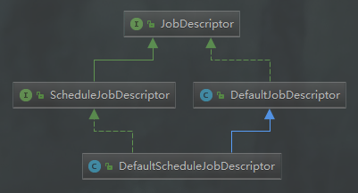
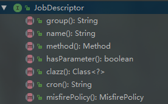
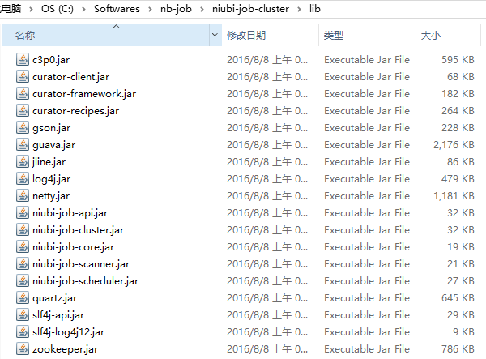
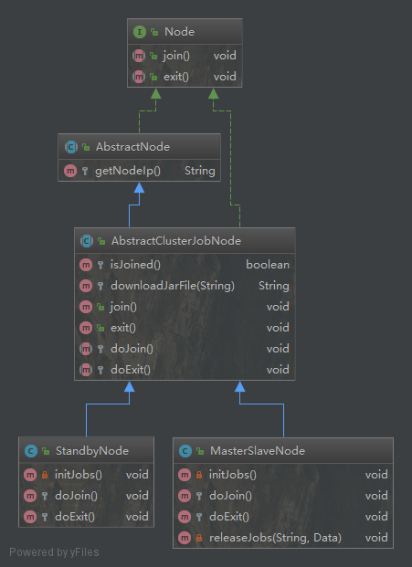

# Web

## 任务上传

这里采用无Spring环境的任务作为示例，代码:

```java
public class Job {
    @Schedule(cron = "0/15 * * * * ?")
    public void doJob() {
        System.out.println("这是测试任务.");
    }
}
```

详细的任务代码编写说明参考原版博客: 

[【niubi-job——一个分布式的任务调度框架】----如何开发一个niubi-job的定时任务](http://www.cnblogs.com/zuoxiaolong/p/niubi-job-2.html)

任务上传由接口`/masterSlaveJobs/upload`完成。

### 重复校验

每上传一个任务都会将任务的概览信息存储的数据库的master_slave_job表，以Master-Slave模式为例，这里进行校验的依据便是文件名。

### 类加载器创建

关键源码:

```java
ApplicationClassLoader classLoader = 
  ApplicationClassLoaderFactory
  .createNormalApplicationClassLoader(applicationContext.getClassLoader(), jarFilePath);
```

applicationContext是Spring便是通过ApplicationContextAware接口注入进来的Spring容器，而AbstractApplicationContext继承自DefaultResourceLoader，ResourceLoader接口中getClassLoader方法源码:

```java
@Override
public ClassLoader getClassLoader() {
    return (this.classLoader != null ? this.classLoader : ClassUtils.getDefaultClassLoader());
}
```

classLoader通过构造器传入，但是Spring使用的是无参构造器，getDefaultClassLoader源码:

```java
public static ClassLoader getDefaultClassLoader() {
    ClassLoader cl = null;
    try {
        cl = Thread.currentThread().getContextClassLoader();
    } catch (Throwable ex) {
        // Cannot access thread context ClassLoader - falling back...
    }
    if (cl == null) {
        // No thread context class loader -> use class loader of this class.
        cl = ClassUtils.class.getClassLoader();
        if (cl == null) {
            // getClassLoader() returning null indicates the bootstrap ClassLoader
            try {
                cl = ClassLoader.getSystemClassLoader();
            } catch (Throwable ex) {
                // Cannot access system ClassLoader - oh well, maybe the caller can live with                    null...
            }
        }
    }
    return cl;
}
```

容易得出结论，由于console模块部署在web场景下，对于Tomcat服务器来说，这里的父加载器必定是Tomcat的应用类加载器，简单的实验便可以证明这一点，我们让一个Controller实现ApplicationContextAware接口:

```java
@Override
public void setApplicationContext(ApplicationContext applicationContext) throws BeansException {
    System.out.println(applicationContext.getClassLoader());
}
```

打印结果是:

```html
ParallelWebappClassLoader
  context: spring
  delegate: false
----------> Parent Classloader:
java.net.URLClassLoader@5e265ba4
```

### 任务描述符

```java
JobScanner jobScanner = JobScannerFactory
    .createJarFileJobScanner(classLoader, packagesToScan, jarFilePath);
List<JobDescriptor> jobDescriptorList = jobScanner.getJobDescriptorList();
```

每一个被@Schedule标注的方法都是一个任务，所以这里返回了一组JobDescriptor，类图:



任务描述符中定义的方法如下:



### 任务扫描

扫描由JobScanner接口完成:


属性/接口定义:


扫描的核心位于scanJarFile方法:

```java
 private void scanJarFile(String jarFilePath) {
    JarFile jarFile = new JarFile(jarFilePath);
    Enumeration<JarEntry> jarEntryEnumeration = jarFile.entries();
    while (jarEntryEnumeration.hasMoreElements()) {
        String jarEntryName = jarEntryEnumeration.nextElement().getName();
        if (jarEntryName != null && jarEntryName.equals(APPLICATION_CONTEXT_XML_PATH)) {
            setHasSpringEnvironment(true);
            continue;
        }
        if (jarEntryName == null || !jarEntryName.endsWith(".class")) {
            continue;
        }
        String className = ClassHelper.getClassName(jarEntryName);
        super.scanClass(className);
    }
}
```

可以看出，是否是Spring环境的判断是通过寻找applicationContext.xml实现的。

# cluster

## 启动

启动的入口位于Bootstrap的main方法，main方法根据传递的命令行参数执行其start方法，源码如下:

```java
public static void start() throws Exception {
    String nodeClassName;
    if ("masterSlave".equals(getNodeMode())) {
        nodeClassName = "com.zuoxiaolong.niubi.job.cluster.node.MasterSlaveNode";
    } else if ("standby".equals(getNodeMode())) {
        nodeClassName = "com.zuoxiaolong.niubi.job.cluster.node.StandbyNode";
    } else {
        throw new ConfigException();
    }
    Class<?> nodeClass = applicationClassLoader.loadClass(nodeClassName);
    Constructor<?> nodeConstructor = nodeClass.getConstructor();
    nodeInstance = nodeConstructor.newInstance();
    Method joinMethod = ReflectHelper.getInheritMethod(nodeClass, "join");
    joinMethod.invoke(nodeInstance);
}
```

这里分为以下两部分。

### 类加载器初始化

由静态初始化代码完成，相关源码:

```java
private static final ClassLoader systemClassLoader = ClassLoader.getSystemClassLoader();
ApplicationClassLoaderFactory.setSystemClassLoader(systemClassLoader);
applicationClassLoader = ApplicationClassLoaderFactory.getNodeApplicationClassLoader();
Thread.currentThread().setContextClassLoader(applicationClassLoader);
initApplicationClassLoader();
```

applicationClassLoader其实是一个ApplicationClassLoader的实例，其继承自URLClassLoader，一般来说，它就是Java的System类加载器的子加载器。关键在于initApplicationClassLoader方法:

```java
private static void initApplicationClassLoader() {
    File libFile = new File(libDir);
    List<String> filePathList = new ArrayList<>();

    File[] jarFiles = libFile.listFiles();
    for (File jarFile : jarFiles) {
        if (jarFile.getName().endsWith(".jar")) {
            filePathList.add(jarFile.getAbsolutePath());
        }
    }
    applicationClassLoader.addFiles(filePathList.toArray());
}
```

集群模块的jar包的存放格式如下图所示:



从启动脚本来看，并没有将此文件夹添加到classpath中，如下:

```shell
cd ${lib_dir}
${java_command} -jar niubi-job-cluster.jar $1
```

而且通过实验可以轻易的证明，在默认情况下，Java只会将当前目录下搜索class文件，但是不会搜索jar包，所以initApplicationClassLoader所做的就显而易见了: 将lib目录下的所有jar包手动加入到classpath中。

### 节点初始化

首先来看一下都有哪些节点类型，如图:



#### Master-Slave

MasterSlaveNode构造器进行了大量个组件初始化工作。

##### zookeeper客户端

这里使用了Netflix开源的Apache Curator，创建的过程的也很简单:

```java
String zookeeperAddresses = Bootstrap.getZookeeperAddresses();
CuratorFramework client = CuratorFrameworkFactory.newClient(zookeeperAddresses, retryPolicy);
```

RetryPolicy接口代表了当间接ZK失败时的重试策略，这里使用的是ExponentialBackoffRetry，即不停地重试，但是每次重试之间的睡眠间隔是不断递增的，怎么这么像那个。。。

##### 分布式锁

节点的初始化需要在持有初始化分布式锁的情况下进行，锁的路径是: /master-slave-node/initLock，这里的锁便是InterProcessMutex。

真正的逻辑位于MasterSlaveNode的doJoin方法:

```java
@Override
protected synchronized void doJoin() {
    leaderSelector.start();
    try {
        this.jobCache.start();
    } catch (Exception e) {
        LoggerHelper.error("path children path start failed.", e);
        throw new NiubiException(e);
    }
}
```